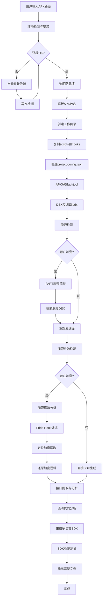
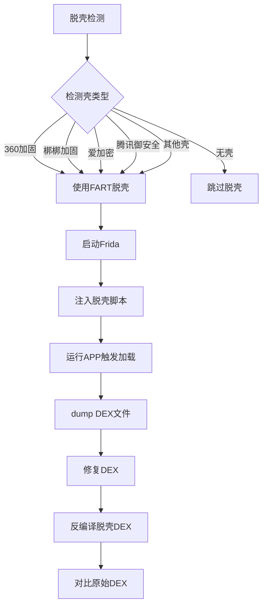
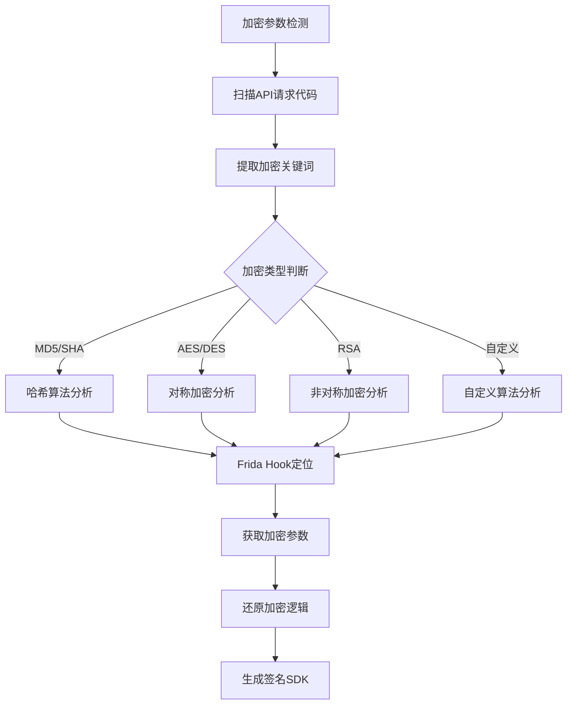

# APK Reverse Engineering SDK Generator

## 概述

这个skill实现了一个完整的APK逆向分析与SDK生成工作流：

1. **输入APK** → 自动检测环境并安装依赖
2. **解包反编译** → apktool解包 + jadx反编译DEX
3. **脱壳检测** → 自动检测加壳并启动FART脱壳流程
4. **加密参数分析** → 分析API加密算法、签名逻辑
5. **接口分析** → 提取所有HTTP接口并生成调用SDK
6. **混淆分析** → 分析代码混淆策略并还原关键逻辑
7. **完整输出** → 分析报告 + SDK文档 + 多语言SDK(Python/Java/JS)

## 流程图

### 整体工作流程



### 脱壳流程详情



### 加密分析流程



## 触发条件

- 用户输入 `/apk-reverse` 命令
- 用户提供 `.apk` 文件路径且上下文暗示需要逆向分析
- 用户提到"APK逆向"、"安卓逆向"、"脱壳"等关键词

## 参考文档索引

按需引入以下参考文档：

| 文档                                          | 用途                               | 引入时机                         |
| --------------------------------------------- | ---------------------------------- | -------------------------------- |
| [workspace-structure.md](references/workspace-structure.md)   | 工作目录结构和配置文件     | Phase 0 初始化时        |
| [apk-tools-guide.md](references/apk-tools-guide.md)           | apktool/jadx/FART使用指南 | Phase 1/2解包时        |
| [frida-hook-guide.md](references/frida-hook-guide.md)         | Frida Hook注入调试指南    | Phase 3逆向时          |
| [encryption-analysis.md](references/encryption-analysis.md)   | 加密算法分析方法           | Phase 3逆向时          |
| [unpacking-detection.md](references/unpacking-detection.md)   | 脱壳检测与处理流程         | Phase 2脱壳时          |
| [api-extraction.md](references/api-extraction.md)             | API接口提取与分析     | Phase 4接口分析时       |
| [obfuscation-analysis.md](references/obfuscation-analysis.md) | 代码混淆分析方法           | Phase 4混淆分析时       |
| [sdk-best-practices.md](references/sdk-best-practices.md)     | SDK生成最佳实践             | Phase 5生成SDK时       |
| [output-specification.md](references/output-specification.md)  | 输出物规范                   | Phase 5输出时          |
| [tech-dependencies.md](references/tech-dependencies.md)       | 工具依赖列表 | 环境准备时              |

## 前置配置询问

**必须首先询问用户以下配置项**（使用 `AskUserQuestion` 工具）：

### 第一批询问

1. **APK路径**: 如果用户未提供，询问APK文件完整路径
2. **SDK语言**: Python / Java / JavaScript（多选）
3. **脱壳方式**: 自动检测并处理(推荐) / 手动选择脱壳工具 / 跳过脱壳
4. **动态调试**: 启用Frida调试 / 仅静态分析

## 工作流程

### Phase -1: 环境检测与安装（前置操作）

**必须在所有Phase之前执行**：

```bash
# 基础检测
python scripts/check-environment.py

# 自动安装
python scripts/check-environment.py --auto-install
```

**检测内容**：
- Java/JDK 版本 (需要 >= 11)
- apktool (APK解包工具)
- jadx (DEX反编译工具)
- Frida (动态调试框架)
- FART (脱壳工具)
- Python 必需包: frida, frida-tools, pycryptodome, jadx-wrapper
- Android 设备连接状态 (动态调试需要)

### Phase 0: 前置配置与工作目录初始化

**参考**: [workspace-structure.md](references/workspace-structure.md)

1. **验证APK文件存在**
2. **解析APK包名**（从APK中提取或生成）
3. **创建工作目录** `apk-projects/{package_name}/`
4. **初始化子目录结构**
5. **复制脚本和Hook文件**
6. **创建配置文件** `project-config.json`

### Phase 1: APK解包与初步分析

**参考**: [apk-tools-guide.md](references/apk-tools-guide.md)

```bash
cd apk-projects/{package_name}

# apktool解包
python scripts/apk-unpacker.py --apk "{apk_path}" --output "./unpacked"

# 提取基本信息
python scripts/apk-info-extractor.py --apk "{apk_path}"
```

**输出**:
- `unpacked/` - APK解包目录
- `apk-info.json` - APK基本信息（包名、版本、权限、组件等）

### Phase 2: DEX反编译与脱壳检测

**参考**: [apk-tools-guide.md](references/apk-tools-guide.md) | [unpacking-detection.md](references/unpacking-detection.md)

```bash
# jadx反编译
python scripts/dex-decompiler.py --dex-dir "./unpacked" --output "./decompiled"

# 脱壳检测
python scripts/packer-detector.py --apk "{apk_path}" --decompiled "./decompiled"
```

**脱壳处理**（检测到加壳时）：

```bash
# FART脱壳流程
python scripts/fart-unpacker.py --apk "{apk_path}" --output "./unpacked-dex"

# 重新反编译脱壳后的DEX
python scripts/dex-decompiler.py --dex-dir "./unpacked-dex" --output "./decompiled-real"
```

### Phase 3: 加密参数分析与逆向

**参考**: [encryption-analysis.md](references/encryption-analysis.md) | [frida-hook-guide.md](references/frida-hook-guide.md)

```bash
# 加密参数检测
python scripts/crypto-param-detector.py --decompiled "./decompiled" --output "./analysis/crypto-analysis.json"

# 存在加密时启动Frida Hook
python scripts/frida-hook-injector.py --apk "{apk_path}" --hook "crypto-hook.js" --output "./hook-output"
```

**Hook脚本列表**：

| Hook脚本 | 功能描述 |
| --- | --- |
| `crypto-hook.js` | 加密函数拦截（MD5/SHA/AES/DES等） |
| `api-hook.js` | HTTP请求拦截 |
| `native-hook.js` | Native函数调用拦截 |
| `string-hook.js` | 字符串操作追踪 |
| `all-in-one-hook.js` | 综合Hook（推荐） |

### Phase 4: 接口提取与混淆分析

**参考**: [api-extraction.md](references/api-extraction.md) | [obfuscation-analysis.md](references/obfuscation-analysis.md)

```bash
# API接口提取
python scripts/api-extractor.py --decompiled "./decompiled" --output "./analysis/api-list.json"

# 混淆代码分析
python scripts/obfuscation-analyzer.py --decompiled "./decompiled" --output "./analysis/obfuscation-report.json"
```

### Phase 5: SDK生成与验证

**参考**: [sdk-best-practices.md](references/sdk-best-practices.md) | [output-specification.md](references/output-specification.md)

```bash
# 生成多语言SDK
python scripts/sdk-generator.py --analysis "./analysis" --languages "python,java,js" --output "./output/sdk"

# SDK验证测试
python scripts/sdk-validator.py --sdk-path "./output/sdk/python" --test-config "./analysis/api-list.json"
```

**输出完整文档**：
- `output/analysis-report.md` - 逆向分析报告
- `output/sdk-document.md` - SDK接口说明文档
- `output/encryption-analysis.md` - 加密算法分析报告
- `output/api-list.md` - API接口清单
- `output/README.md` - 使用说明
- `output/sdk/{language}/` - SDK代码

## 输出物规范

### 分析报告结构

```markdown
# APK逆向分析报告

## 1. APK基本信息
- 包名、版本、签名信息
- 权限清单、组件清单

## 2. 脱壳分析
- 加壳检测结果
- 脱壳方法与结果

## 3. 加密参数分析
- 加密算法类型
- 加密参数来源
- 签名逻辑还原

## 4. API接口分析
- 接口清单
- 参数说明
- 调用示例

## 5. 代码混淆分析
- 混淆策略
- 关键代码还原

## 6. SDK使用说明
- 安装方法
- 调用示例
```

### SDK代码规范

**Python SDK示例**：

```python
class APIClient:
    """自动生成的API调用SDK"""

    BASE_URL = "https://api.example.com"

    def __init__(self, device_id: str = None):
        self.device_id = device_id or self._generate_device_id()
        self.session = requests.Session()

    def _sign(self, params: dict) -> str:
        """签名算法还原"""
        # 根据分析结果生成签名逻辑
        ...

    def request_api(self, endpoint: str, params: dict) -> dict:
        """通用API请求"""
        params["sign"] = self._sign(params)
        response = self.session.post(f"{self.BASE_URL}/{endpoint}", json=params)
        return response.json()
```

## 环境准备

**详细依赖**: [tech-dependencies.md](references/tech-dependencies.md)

```bash
# 安装基础工具
# Java JDK
# Windows: 下载安装包或使用 scoop/choco
# Linux/Mac: 
sudo apt install openjdk-11-jdk  # Linux
brew install openjdk@11          # Mac

# apktool
# 下载: https://ibotpeaches.github.io/Apktool/install/

# jadx
# 下载: https://github.com/skylot/jadx/releases

# Frida
pip install frida frida-tools

# Python依赖
pip install -r requirements.txt
```

## 快速开始

```bash
# 1. 初始化项目
python scripts/init-workspace.py --apk "path/to/app.apk"

# 2. 进入项目目录
cd apk-projects/com.example.app

# 3. 执行分析流程
python scripts/apk-unpacker.py --apk "path/to/app.apk"
python scripts/dex-decompiler.py --dex-dir "./unpacked"
python scripts/crypto-param-detector.py --decompiled "./decompiled"
python scripts/sdk-generator.py --analysis "./analysis" --languages "python"
```

## 使用示例

```
用户: /apk-reverse path/to/app.apk

Skill执行:
[Phase 0] 初始化工作目录 → apk-projects/com.example.app/
[Phase 0] 创建项目配置 → project-config.json
[Phase 1] APK解包 → unpacked/ 目录
[Phase 1] APK信息 → 包名: com.example.app, 版本: 1.2.3
[Phase 2] DEX反编译 → decompiled/ 目录
[Phase 2] 脱壳检测 → 检测到360加固
[Phase 2] FART脱壳 → 获取真实DEX
[Phase 3] 加密检测 → 发现sign参数使用MD5
[Phase 3] Frida Hook → 定位加密函数在 CryptoHelper.java
[Phase 4] API提取 → 15个HTTP接口
[Phase 4] 混淆分析 → ProGuard混淆
[Phase 5] SDK生成 → Python/Java/JS SDK
[Phase 5] 输出完成 → analysis-report.md, sdk-document.md, README.md
```

## 相关资源

### Skill源目录

- **初始化脚本**: `scripts/init-workspace.py`
- **脚本模板**: `scripts/`
- **Hook模板**: `hooks/`
- **SDK模板**: `assets/`
- **参考文档**: `references/`

### 项目工作目录

初始化后复制到 `apk-projects/{package_name}/`：

- **scripts/** - 所有分析脚本
- **hooks/** - Frida Hook脚本
- **analysis/** - 分析结果目录
- **output/** - 输出SDK目录