# 文档驱动全栈AI自动化开发工作流

## 核心定位

构建**技术栈智能调研、文档全链路驱动、变更自动同步、全节点可校验、全版本可追溯**的全栈应用自动化开发体系。

---

## 文档索引（按需引入）

### 核心规范文档

| 文档                                                   | 用途                                       | 引入时机             |
| ------------------------------------------------------ | ------------------------------------------ | -------------------- |
| [global-rules.md](references/global-rules.md)             | 全局强制铁律、项目类型判断、ID命名规范     | 启动时必须阅读       |
| [workflow-phases.md](references/workflow-phases.md)       | 阶段-1至阶段5详细执行流程                  | 执行各阶段时按需引入 |
| [project-structure.md](references/project-structure.md)   | 标准化目录结构、索引模板、version.json格式 | 阶段0项目初始化      |
| [tech-stack-matrix.md](references/tech-stack-matrix.md)   | 前端/后端/AI/数据存储技术栈调研矩阵        | 阶段-1技术选型       |
| [ai-execution-rules.md](references/ai-execution-rules.md) | AI执行规范、使用示例、自检报告模板         | 执行开发任务时       |

### 模板文档

| 文档                                                                           | 用途                               | 引入时机     |
| ------------------------------------------------------------------------------ | ---------------------------------- | ------------ |
| [agents-template.md](references/agents-template.md)                               | AGENTS.md AI Agent开发指导文档模板 | 阶段-1/阶段0 |
| [plan-template.md](references/plan-template.md)                                   | 实施计划文档模板                   | 阶段3开发前  |
| [tech-selection-report-template.md](references/tech-selection-report-template.md) | 技术选型报告模板                   | 阶段-1       |
| [dependency-matrix-template.yaml](references/dependency-matrix-template.yaml)     | 文档依赖矩阵模板                   | 阶段0        |
| [page-design-template.md](references/page-design-template.md)                     | 单页面设计文档模板                 | 阶段2.2      |
| [api-design-template.md](references/api-design-template.md)                       | 单接口设计文档模板                 | 阶段2.3      |
| [change-impact-report-template.md](references/change-impact-report-template.md)   | 变更影响分析报告模板               | 阶段5        |

---

## 阶段概览

| 阶段   | 名称                 | 适用项目  | 关键输出                            | 完成检查 |
| ------ | -------------------- | --------- | ----------------------------------- | -------- |
| 阶段-1 | 技术栈调研与选型     | 新项目    | tech-selection-report.md, AGENTS.md, **已搜索Skills** | AI准出校验 + **Skills搜索确认** |
| 阶段0  | 项目初始化与底座搭建 | 新/老项目 | docs体系, 依赖矩阵, AGENTS.md       | 强制输出物检查 |
| 阶段1  | 需求全链路标准化     | 所有项目  | prd.md, srs.md                      | phase-1-check.md |
| 阶段2  | 系统架构与分端设计   | 所有项目  | 架构设计, 页面/接口设计, 扩展设计    | phase-2-check.md |
| 阶段3  | 分端模块化开发       | 所有项目  | 源代码, 实施计划                    | phase-3-check.md |
| 阶段4  | 自动化集成测试与交付 | 所有项目  | 测试报告, 部署文档                  | phase-4-check.md |
| 阶段5  | 需求变更闭环管控     | 所有项目  | 变更报告                            | phase-5-check.md |

---

## 核心特性

### 1. 前端设计集成 ui-ux-pro-max 技能

阶段2前端设计必须使用 `ui-ux-pro-max` 技能进行高质量设计：

- **UI风格选择**：50+预设风格
- **色彩方案**：161种配色方案
- **字体搭配**：57种字体组合
- **响应式布局适配**：移动端/平板/桌面端
- **UX交互规范**：99项UX准则
- **图表类型选择**：25种图表类型

**使用方式**：调用 Skill 工具激活 `ui-ux-pro-max` 技能

### 2. 扩展文档目录支持

根据项目类型启用扩展文档目录：

| 项目类型 | 扩展目录 | 设计内容 |
|----------|----------|----------|
| Web3/DApp | `docs/05-smart-contract-design/` | 智能合约架构、状态变量、方法设计、安全设计 |
| AI/LLM应用 | `docs/06-ai-design/` | Prompt库、Agent流程、RAG管道、模型配置 |
| E2E测试项目 | `docs/04-test-acceptance/e2e/` | 测试场景、数据流测试、断言规则 |
| 移动应用 | `docs/07-mobile-design/` | 平台适配、推送服务、离线策略 |
| CLI工具 | `docs/08-cli-design/` | 命令规格、参数解析、输出格式 |
| 企业级系统 | `docs/09-devops-design/`, `docs/10-security-design/` | CI/CD流水线、监控日志、认证加密 |

### 3. 每阶段强制完成检查

每个阶段完成后必须生成检查报告：

- `docs/phase-check-reports/phase-1-check.md` - 需求文档完整性检查
- `docs/phase-check-reports/phase-2-check.md` - 设计文档完整性检查
- `docs/phase-check-reports/phase-3-check.md` - 开发代码完整性检查
- `docs/phase-check-reports/phase-4-check.md` - 测试验收完整性检查
- `docs/phase-check-reports/phase-5-check.md` - 变更闭环完整性检查

### 4. ⚠️ 技术栈 Skills 自动搜索（强制执行）

**这是阶段-1完成后必须执行的步骤，不可跳过！**

```
⚠️ 强制流程：阶段-1完成 → 自动搜索技术栈Skills → 用户确认 → 安装Skills → 进入阶段0
```

**执行步骤**：

1. **解析 AGENTS.md**：从生成的 AGENTS.md 中提取所有锁定的技术栈
2. **遍历技术栈**：对每项技术执行 `/find-skills <技术关键词>` 搜索
3. **汇总结果**：收集所有搜索到的相关 Skills
4. **用户确认**：使用 AskUserQuestion 让用户选择需要引入的 Skills
5. **安装 Skills**：安装用户选定的 Skills，确保后续开发符合最佳实践

**关键提醒**：
- 🔴 **新项目必须执行此步骤**，否则后续开发可能缺乏技术栈规范指导
- 🔴 **阶段-1准出校验要求**：已完成技术栈 Skills 搜索，用户已确认是否引入
- 🔴 **若搜索无结果**：仍需报告搜索结果为空，让用户确认后继续

---

## 快速使用示例

```bash
# 新项目完整流程
"我要开发一个AI知识库问答系统，请帮我完成从技术选型到开发的完整流程"

# 阶段-1：技术栈调研
"请为我调研适合开发电商后台管理系统的技术栈，我倾向使用TypeScript"

# 老项目初始化
"这是一个已有的React项目，请按阶段0搭建文档驱动开发体系"

# 阶段3：开发前生成计划
"请为用户模块开发生成实施计划"

# 阶段5：需求变更
"请按阶段5处理需求变更：用户模块增加头像上传功能"
```

---

## 工作流程图

```mermaid
flowchart TB
    A[启动] --> B{项目类型判断}
    B -->|新项目| C[阶段-1: 技术栈调研]
    B -->|老项目| D[阶段0: 项目初始化]

    C --> C1[解析需求定位项目]
    C1 --> C2[AskUserQuestion: 选择主语言]
    C2 --> C3[技术栈智能调研]
    C3 --> C4[用户确认技术栈]
    C4 --> C5[生成技术选型报告]
    C5 --> C6[生成AGENTS.md]
    C6 --> C7[自动搜索技术栈Skills]

    C7 --> C8[解析AGENTS.md技术栈]
    C8 --> C9[执行find-skills搜索]
    C9 --> C10[用户确认引入Skills]
    C10 --> D

    D --> D1{项目类型}
    D1 -->|新项目| D2[定义全局规范]
    D1 -->|老项目| D3[分析现有代码]
    D2 --> D5[搭建docs体系]
    D3 --> D4[生成AGENTS.md]
    D4 --> D5
    D5 --> D6[搭建依赖矩阵]
    D6 --> D7[首次备份v1.0.0]

    D7 --> E[阶段1: 需求标准化]
    E --> E1[需求拆解分配ID]
    E1 --> E2[生成prd/srs.md]
    E2 --> E3[分模块需求文档]
    E3 --> E4[更新依赖矩阵]

    E4 --> F[阶段2: 架构设计]
    F --> F1[系统架构设计]
    F --> F2[前端UI设计]
    F --> F3[后端接口设计]
    F1 --> FX[架构设计文档]
    F2 --> FX
    F3 --> FX

    FX --> G[阶段3: 模块化开发]
    G --> G1[生成实施计划PLAN]
    G1 --> G2[用户确认计划]
    G2 --> G3[前置校验文档]
    G3 --> G4[标记计划执行中]
    G4 --> G5[前端开发]
    G4 --> G6[后端开发]
    G4 --> G8[CLI开发]
    G4 --> G9[XXX开发]
    G5 --> G7[单元测试]
    G6 --> G7
    G7 --> G8[归档计划]

    G8 --> H[阶段4: 集成测试]
    H --> H1[集成联调]
    H1 --> H2[全量测试]
    H2 --> H3[上线交付]

    H3 --> I{需求变更?}
    I -->|有变更| J[阶段5: 变更闭环]
    J --> J1[备份影响分析]
    J1 --> J2[文档同步]
    J2 --> J3[代码变更]
    J3 --> G
    I -->|无变更| K[完成]
```



---

## ⚠️ 技术栈 Skill 自动发现（阶段-1 后强制执行）

> 🔴 **重要提醒**：此步骤是阶段-1准出的**强制条件**，必须执行！
> 若未执行此步骤，阶段-1视为未完成，不得进入阶段0！

在阶段-1技术栈确定后，**必须自动搜索并引入相关技术栈规范 Skill**，确保开发符合最佳实践。

### 执行时机（强制）

```
⏰ 必须执行时间点：
阶段-1完成 → AGENTS.md 生成 → 立即执行技术栈Skills搜索 → 用户确认 → 安装 → 进入阶段0
```

**禁止跳过此步骤！即使搜索结果为空，也需向用户报告。**

### 使用 find-skills 指令

```bash
# 基本搜索语法
/find-skills <技术关键词>

# 示例：搜索前端框架相关 skills
/find-skills react
/find-skills vue
/find-skills nextjs
/find-skills typescript

# 示例：搜索后端框架相关 skills
/find-skills fastapi
/find-skills nestjs
/find-skills spring-boot
/find-skills golang

# 示例：搜索数据库相关 skills
/find-skills postgresql
/find-skills prisma
/find-skills mongodb

# 示例：搜索 AI 相关 skills
/find-skills langchain
/find-skills langgraph
/find-skills rag
```

### 自动搜索映射表

根据 AGENTS.md 中锁定的技术栈，自动执行对应搜索：

| 技术栈类型 | 锁定技术 | 自动搜索指令 |
|------------|----------|--------------|
| 前端框架 | Next.js | `/find-skills nextjs` |
| 前端框架 | React | `/find-skills react` |
| 前端框架 | Vue | `/find-skills vue` |
| 前端框架 | Nuxt | `/find-skills nuxt` |
| 后端框架 | FastAPI | `/find-skills fastapi` |
| 后端框架 | NestJS | `/find-skills nestjs` |
| 后端框架 | Spring Boot | `/find-skills spring-boot` |
| 后端框架 | Express | `/find-skills express` |
| 后端框架 | Gin/Go | `/find-skills golang` |
| ORM | Prisma | `/find-skills prisma` |
| ORM | TypeORM | `/find-skills typeorm` |
| 数据库 | PostgreSQL | `/find-skills postgresql` |
| 数据库 | MongoDB | `/find-skills mongodb` |
| AI框架 | LangChain | `/find-skills langchain` |
| AI框架 | LangGraph | `/find-skills langgraph` |
| 语言 | TypeScript | `/find-skills typescript` |
| 语言 | Python | `/find-skills python` |

### 执行流程

```
阶段-1完成 → 解析AGENTS.md技术栈 → 遍历技术栈清单 → 
对每项技术执行 /find-skills → 评估搜索结果 → 
AskUserQuestion确认引入哪些skills → 安装选定的skills → 
进入阶段0
```

### Skill 引入确认

搜索到相关 skills 后，使用 AskUserQuestion 让用户确认：

```
找到以下技术栈相关 Skills：
1. [skill-name-1] - 描述
2. [skill-name-2] - 描述
3. [skill-name-3] - 描述

请选择需要引入的 Skills：
□ skill-name-1 (推荐)
□ skill-name-2
□ skill-name-3
□ 全部引入
□ 跳过
```

---

## 执行入口流程

启动时执行：

1. 判断项目类型（新项目/老项目）→ 参考 [global-rules.md](references/global-rules.md)
2. 根据项目类型选择起始阶段 → 参考 [workflow-phases.md](references/workflow-phases.md)
3. 🔴 **新项目：阶段-1完成后必须自动搜索技术栈 skills** → 使用 `/find-skills` 指令（强制步骤，不可跳过）
4. 按需引入相关模板文档执行

---

## ⚠️ 执行检查清单（AI必须自检）

在执行阶段-1时，AI必须确认以下检查项：

| 检查项 | 检查标准 | 是否强制 |
|--------|----------|----------|
| 技术选型报告生成 | tech-selection-report.md 已生成 | ✅ 强制 |
| AGENTS.md 生成 | AGENTS.md 包含完整技术栈锁定信息 | ✅ 强制 |
| **技术栈Skills搜索执行** | 已对所有锁定技术执行 `/find-skills` 搜索 | ✅ **强制** |
| **搜索结果已报告** | 已向用户展示搜索结果（即使为空） | ✅ **强制** |
| **用户已确认引入** | 用户已通过 AskUserQuestion 确认是否引入Skills | ✅ **强制** |

**禁止跳过检查项！所有强制项必须满足才能进入阶段0。**
