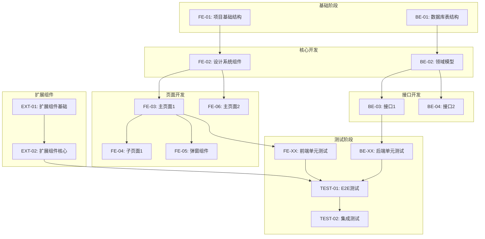

# 实施计划：[计划名称]

> 本计划由 fullstack-dev-workflow skill 生成，开发代码前必须先生成并确认计划
> ⚠️ **计划必须包含所有开发任务及对应设计文档链接，确保完整追溯**

---

## 一、计划基础信息

| 属性 | 内容 |
|------|------|
| 计划ID | PLAN-{类型}-{模块}-{日期}-{序号} |
| 计划名称 | 【计划名称】 |
| 关联需求ID | REQ-XXX-XXX |
| 执行范围 | 前端 / 后端 / 全栈 / 扩展组件 |
| 计划状态 | pending / in_progress / completed / cancelled |
| 创建时间 | 【YYYY-MM-DD HH:mm:ss】 |
| 开始时间 | 【执行开始时间】 |
| 完成时间 | 【执行完成时间】 |
| 预计工时 | 【预估时间】 |
| 实际工时 | 【实际耗时】 |

### 计划ID命名规则

| 类型代码 | 说明 | 示例 |
|----------|------|------|
| FE | 前端开发 | PLAN-FE-user-module-20260409-001 |
| BE | 后端开发 | PLAN-BE-auth-api-20260409-002 |
| FS | 全栈开发 | PLAN-FS-order-system-20260409-003 |
| FIX | 缺陷修复 | PLAN-FIX-login-bug-20260409-004 |
| REF | 代码重构 | PLAN-REF-data-layer-20260409-005 |
| EXT | 扩展组件（智能合约/AI等） | PLAN-EXT-smart-contract-20260409-006 |

---

## 二、设计文档清单（必须完整填写）

> 🔴 **强制要求**：所有设计文档链接必须填写，确保开发有据可依

### 2.1 架构设计文档

| 文档名称 | 文档路径 | 状态 | 备注 |
|----------|----------|------|------|
| 系统架构设计 | [docs/01-architecture/system-architecture.md](docs/01-architecture/system-architecture.md) | ✅/待确认 | 架构概览 |
| 领域模型设计 | [docs/03-backend-design/domain-model.md](docs/03-backend-design/domain-model.md) | ✅/待确认 | 后端领域 |

### 2.2 前端设计文档（按页面列出）

| 页面名称 | 设计文档路径 | 子页面数 | 状态 |
|----------|--------------|----------|------|
| 【主页面1】 | [docs/02-frontend-design/pages/main/【页面名】.md](docs/02-frontend-design/pages/main/xxx.md) | N | ✅/待设计 |
| 【主页面1-子页面1】 | [docs/02-frontend-design/pages/sub/【子页面名】.md](docs/02-frontend-design/pages/sub/xxx.md) | - | ✅/待设计 |
| 【主页面1-弹窗/抽屉】 | [docs/02-frontend-design/pages/modal/【弹窗名】.md](docs/02-frontend-design/pages/modal/xxx.md) | - | ✅/待设计 |
| 【主页面2】 | [docs/02-frontend-design/pages/main/xxx.md](docs/02-frontend-design/pages/main/xxx.md) | N | ✅/待设计 |
| ... | ... | ... | ... |

**设计系统参考**：[docs/02-frontend-design/design-system.md](docs/02-frontend-design/design-system.md)
**页面地图参考**：[docs/02-frontend-design/page-map.md](docs/02-frontend-design/page-map.md)

### 2.3 后端接口设计文档（按接口列出）

| 接口名称 | 设计文档路径 | 对应页面 | 状态 |
|----------|--------------|----------|------|
| 【接口1】 | [docs/03-backend-design/api-spec/【接口名】.md](docs/03-backend-design/api-spec/xxx.md) | 【页面】 | ✅/待设计 |
| 【接口2】 | [docs/03-backend-design/api-spec/xxx.md](docs/03-backend-design/api-spec/xxx.md) | 【页面】 | ✅/待设计 |
| ... | ... | ... | ... |

**API全局标准**：[docs/03-backend-design/api-global-standard.md](docs/03-backend-design/api-global-standard.md)
**数据库设计**：[docs/03-backend-design/database-design/index.md](docs/03-backend-design/database-design/index.md)

### 2.4 扩展组件设计文档（按项目类型填写）

| 组件类型 | 设计文档路径 | 状态 | 备注 |
|----------|--------------|------|------|
| **智能合约（Web3项目）** | | | |
| 合约架构 | [docs/05-smart-contract-design/contract-architecture.md](docs/05-smart-contract-design/contract-architecture.md) | ✅/待设计 | |
| 合约方法 | [docs/05-smart-contract-design/methods/xxx.md](docs/05-smart-contract-design/methods/xxx.md) | ✅/待设计 | |
| **AI/Prompt设计（AI应用）** | | | |
| Prompt库 | [docs/06-ai-design/prompt-library/index.md](docs/06-ai-design/prompt-library/index.md) | ✅/待设计 | |
| Agent流程 | [docs/06-ai-design/agent-flow/index.md](docs/06-ai-design/agent-flow/index.md) | ✅/待设计 | |
| RAG管道 | [docs/06-ai-design/rag-pipeline/index.md](docs/06-ai-design/rag-pipeline/index.md) | ✅/待设计 | |
| **E2E测试设计** | | | |
| 测试场景 | [docs/04-test-acceptance/e2e/scenarios/index.md](docs/04-test-acceptance/e2e/scenarios/index.md) | ✅/待设计 | |
| **移动应用设计** | | | |
| 平台适配 | [docs/07-mobile-design/platform-adaptation.md](docs/07-mobile-design/platform-adaptation.md) | ✅/待设计 | |
| **CLI工具设计** | | | |
| 命令规格 | [docs/08-cli-design/command-spec.md](docs/08-cli-design/command-spec.md) | ✅/待设计 | |

---

## 三、完整任务列表（必须排列所有任务）

> 🔴 **强制要求**：必须列出所有开发任务，不可遗漏，每项任务必须有对应设计文档链接

### 3.1 前端开发任务

| 序号 | 任务名称 | 对应设计文档链接 | 输出文件路径 | 预计工时 | 依赖任务 | 状态 |
|------|----------|------------------|--------------|----------|----------|------|
| FE-01 | 搭建项目基础结构 | [system-architecture.md](docs/01-architecture/system-architecture.md) | src/frontend/ | 2h | 无 | pending |
| FE-02 | 开发设计系统组件 | [design-system.md](docs/02-frontend-design/design-system.md) | src/frontend/components/base/ | 4h | FE-01 | pending |
| FE-03 | 开发【主页面1】 | [pages/main/xxx.md](docs/02-frontend-design/pages/main/xxx.md) | src/frontend/pages/xxx.tsx | 3h | FE-02 | pending |
| FE-04 | 开发【主页面1-子页面1】 | [pages/sub/xxx.md](docs/02-frontend-design/pages/sub/xxx.md) | src/frontend/pages/xxx/sub.tsx | 2h | FE-03 | pending |
| FE-05 | 开发【主页面1-弹窗】 | [pages/modal/xxx.md](docs/02-frontend-design/pages/modal/xxx.md) | src/frontend/components/modals/ | 1h | FE-03 | pending |
| FE-06 | 开发【主页面2】 | [pages/main/yyy.md](docs/02-frontend-design/pages/main/yyy.md) | src/frontend/pages/yyy.tsx | 3h | FE-02 | pending |
| FE-07 | ... | ... | ... | ... | ... | pending |
| FE-XX | 前端单元测试 | 各页面设计文档 | src/frontend/__tests__/ | 3h | 所有FE任务 | pending |

### 3.2 后端开发任务

| 序号 | 任务名称 | 对应设计文档链接 | 输出文件路径 | 预计工时 | 依赖任务 | 状态 |
|------|----------|------------------|--------------|----------|----------|------|
| BE-01 | 数据库表结构创建 | [database-design/index.md](docs/03-backend-design/database-design/index.md) | migrations/ | 1h | 无 | pending |
| BE-02 | 领域模型开发 | [domain-model.md](docs/03-backend-design/domain-model.md) | src/backend/domain/ | 3h | BE-01 | pending |
| BE-03 | 开发【接口1】 | [api-spec/xxx.md](docs/03-backend-design/api-spec/xxx.md) | src/backend/api/xxx.py | 2h | BE-02 | pending |
| BE-04 | 开发【接口2】 | [api-spec/yyy.md](docs/03-backend-design/api-spec/yyy.md) | src/backend/api/yyy.py | 2h | BE-02 | pending |
| BE-05 | ... | ... | ... | ... | ... | pending |
| BE-XX | 后端单元测试 | 各接口设计文档 | src/backend/tests/ | 3h | 所有BE任务 | pending |

### 3.3 扩展组件开发任务（按项目类型填写）

| 序号 | 任务名称 | 对应设计文档链接 | 输出文件路径 | 预计工时 | 依赖任务 | 状态 |
|------|----------|------------------|--------------|----------|----------|------|
| **智能合约开发** | | | | | | |
| EXT-01 | 合约架构搭建 | [contract-architecture.md](docs/05-smart-contract-design/contract-architecture.md) | contracts/ | 2h | 无 | pending |
| EXT-02 | 合约方法开发 | [methods/xxx.md](docs/05-smart-contract-design/methods/xxx.md) | contracts/xxx.sol | 4h | EXT-01 | pending |
| EXT-03 | 合约安全审计 | [security/index.md](docs/05-smart-contract-design/security/index.md) | audit-report.md | 2h | EXT-02 | pending |
| **AI组件开发** | | | | | | |
| EXT-01 | Prompt模板开发 | [prompt-library/index.md](docs/06-ai-design/prompt-library/index.md) | prompts/ | 2h | 无 | pending |
| EXT-02 | Agent流程实现 | [agent-flow/index.md](docs/06-ai-design/agent-flow/index.md) | src/ai/agent/ | 4h | EXT-01 | pending |
| EXT-03 | RAG管道搭建 | [rag-pipeline/index.md](docs/06-ai-design/rag-pipeline/index.md) | src/ai/rag/ | 3h | EXT-01 | pending |
| **其他扩展组件** | | | | | | |
| EXT-XX | ... | ... | ... | ... | ... | pending |

### 3.4 测试与集成任务

| 序号 | 任务名称 | 对应设计文档链接 | 输出文件路径 | 预计工时 | 依赖任务 | 状态 |
|------|----------|------------------|--------------|----------|----------|------|
| TEST-01 | E2E测试场景实现 | [e2e/scenarios/index.md](docs/04-test-acceptance/e2e/scenarios/index.md) | tests/e2e/ | 4h | FE-XX, BE-XX | pending |
| TEST-02 | 集成测试 | 测试验收文档 | tests/integration/ | 3h | TEST-01 | pending |
| TEST-03 | 性能测试 | 测试验收文档 | perf-reports/ | 2h | TEST-02 | pending |

---

## 四、任务执行顺序与依赖关系



### 开发阶段划分

| 阶段 | 任务范围 | 预计总工时 | 关键里程碑 |
|------|----------|------------|------------|
| **阶段1：基础设施** | FE-01, BE-01, EXT-01 | Xh | 项目骨架完成 |
| **阶段2：核心开发** | FE-02, BE-02, EXT-02 | Xh | 核心组件/模型完成 |
| **阶段3：业务实现** | FE-03~FE-XX, BE-03~BE-XX | Xh | 所有页面/接口完成 |
| **阶段4：测试验收** | TEST-01~TEST-03 | Xh | 测试通过，可交付 |

---

## 五、技术实现要点

### 5.1 核心技术方案

【描述核心技术实现方案，引用设计文档中的技术规范】

### 5.2 关键代码结构

```
【预计代码目录结构】
src/
├── frontend/
│   ├── components/
│   │   ├── base/       # 基础组件（设计系统）
│   │   └── modals/     # 弹窗组件
│   ├── pages/
│   │   ├── xxx.tsx     # 主页面
│   │   └── xxx/        # 子页面目录
│   └── __tests__/      # 前端测试
├── backend/
│   ├── domain/         # 领域模型
│   ├── api/            # API接口
│   └── tests/          # 后端测试
└── ai/                  # AI组件（如涉及）
    ├── agent/
    └── rag/
```

### 5.3 技术注意事项

| 注意点 | 说明 | 对应设计文档 |
|--------|------|--------------|
| 【注意1】 | 【详细说明】 | [设计文档链接](docs/xxx.md) |
| 【注意2】 | 【详细说明】 | [设计文档链接](docs/xxx.md) |

---

## 六、依赖关系

### 6.1 外部依赖

| 依赖项 | 版本 | 用途 | 对应技术栈文档 |
|--------|------|------|----------------|
| 【依赖名】 | v【版本】 | 【用途】 | AGENTS.md 技术栈锁定 |

### 6.2 内部依赖

| 依赖模块 | 依赖方式 | 说明 |
|----------|----------|------|
| 【模块名】 | 强依赖/弱依赖 | 【说明】 |

### 6.3 设计文档依赖

> 🔴 **强制要求**：所有开发必须追溯设计文档

| 任务类型 | 必须引用的设计文档 | 追溯方式 |
|----------|---------------------|----------|
| 前端页面开发 | 页面设计文档 (pages/*.md) | 代码文件头注释 |
| 前端组件开发 | 设计系统文档 (design-system.md) | 代码文件头注释 |
| 后端接口开发 | API规范文档 (api-spec/*.md) | 代码文件头注释 |
| 数据库开发 | 数据库设计文档 (database-design/*.md) | migration文件注释 |
| 扩展组件开发 | 对应扩展设计文档 | 代码文件头注释 |

---

## 七、风险点与应对

### 7.1 技术风险

| 风险点 | 风险等级 | 影响范围 | 应对措施 |
|--------|----------|----------|----------|
| 【风险1】 | 高/中/低 | 【范围】 | 【措施】 |

### 7.2 进度风险

| 风险点 | 可能性 | 应对措施 |
|--------|--------|----------|
| 【风险1】 | 高/中/低 | 【措施】 |

### 7.3 兼容性风险

| 风险点 | 影响范围 | 应对措施 |
|--------|----------|----------|
| 【风险1】 | 【范围】 | 【措施】 |

---

## 八、验收标准

### 8.1 功能验收

| 验收项 | 验收标准 | 验收方式 | 对应设计文档 |
|--------|----------|----------|--------------|
| 【验收项1】 | 【标准描述】 | 【方式】 | [设计文档链接](docs/xxx.md) |

### 8.2 代码质量验收

| 验收项 | 标准 | 检查方式 |
|--------|------|----------|
| 代码风格 | 符合项目规范（ESLint/Prettier） | CI检查 |
| 单元测试 | 核心逻辑覆盖率100% | 测试报告 |
| 注释完整 | 关键逻辑有注释 | 代码审查 |
| **文档追溯** | **代码文件头标注设计文档路径** | **强制检查** |

### 8.3 性能验收

| 指标 | 标准 | 对应设计文档 |
|------|------|--------------|
| 响应时间 | 【标准】 | [system-architecture.md](docs/01-architecture/system-architecture.md) |
| 资源占用 | 【标准】 | [system-architecture.md](docs/01-architecture/system-architecture.md) |

---

## 九、执行记录

### 9.1 执行日志

| 时间 | 任务ID | 操作 | 状态 | 备注 |
|------|--------|------|------|------|
| 【时间】 | FE-01 | 【操作描述】 | 成功/失败 | 【备注】 |

### 9.2 问题记录

| 问题ID | 关联任务 | 问题描述 | 发现时间 | 解决方案 | 解决时间 |
|--------|----------|----------|----------|----------|----------|
| ISS-001 | FE-03 | 【问题描述】 | 【时间】 | 【方案】 | 【时间】 |

### 9.3 变更记录

| 变更时间 | 变更任务 | 变更内容 | 变更原因 |
|----------|----------|----------|----------|
| 【时间】 | FE-05 | 【内容】 | 【原因】 |

---

## 十、输出文件清单

### 10.1 前端输出文件

| 文件类型 | 文件路径 | 对应设计文档 | 说明 |
|----------|----------|--------------|------|
| 页面组件 | src/frontend/pages/xxx.tsx | [pages/main/xxx.md](docs/02-frontend-design/pages/main/xxx.md) | 主页面 |
| 子页面组件 | src/frontend/pages/xxx/sub.tsx | [pages/sub/xxx.md](docs/02-frontend-design/pages/sub/xxx.md) | 子页面 |
| 弹窗组件 | src/frontend/components/modals/xxx.tsx | [pages/modal/xxx.md](docs/02-frontend-design/pages/modal/xxx.md) | 弹窗 |
| 基础组件 | src/frontend/components/base/xxx.tsx | [design-system.md](docs/02-frontend-design/design-system.md) | 设计系统组件 |
| 测试代码 | src/frontend/__tests__/xxx.test.ts | 各页面设计文档 | 单元测试 |

### 10.2 后端输出文件

| 文件类型 | 文件路径 | 对应设计文档 | 说明 |
|----------|----------|--------------|------|
| API接口 | src/backend/api/xxx.py | [api-spec/xxx.md](docs/03-backend-design/api-spec/xxx.md) | 接口实现 |
| 领域模型 | src/backend/domain/xxx.py | [domain-model.md](docs/03-backend-design/domain-model.md) | 领域服务 |
| 数据迁移 | migrations/xxx.sql | [database-design/index.md](docs/03-backend-design/database-design/index.md) | 数据库表 |
| 测试代码 | src/backend/tests/xxx.test.py | 各接口设计文档 | 单元测试 |

### 10.3 扩展组件输出文件（按项目类型）

| 文件类型 | 文件路径 | 对应设计文档 | 说明 |
|----------|----------|--------------|------|
| **智能合约** | contracts/xxx.sol | [methods/xxx.md](docs/05-smart-contract-design/methods/xxx.md) | 合约实现 |
| **AI组件** | src/ai/agent/xxx.py | [agent-flow/index.md](docs/06-ai-design/agent-flow/index.md) | Agent实现 |
| **Prompt模板** | prompts/xxx.md | [prompt-library/index.md](docs/06-ai-design/prompt-library/index.md) | Prompt文件 |

---

## 十一、计划确认与检查清单

> 🔴 **强制要求**：计划确认前必须完成以下检查

### 11.1 计划完整性检查

| 检查项 | 检查标准 | 是否满足 |
|--------|----------|----------|
| 设计文档清单完整 | 所有设计文档已列出且有链接 | ✅/❌ |
| 前端任务完整 | 所有页面（含子页面）已有对应任务 | ✅/❌ |
| 后端任务完整 | 所有接口已有对应任务 | ✅/❌ |
| 扩展组件任务完整 | 扩展设计文档已有对应任务（如涉及） | ✅/❌ |
| 测试任务完整 | 单元测试、E2E测试任务已列出 | ✅/❌ |
| 任务依赖关系清晰 | 所有任务依赖关系已标注 | ✅/❌ |
| 设计文档链接完整 | 每个任务都有对应设计文档链接 | ✅/❌ |

### 11.2 用户确认记录

| 确认项 | 用户选择 | 确认时间 |
|--------|----------|----------|
| 计划完整性 | 确认/修改 | 【时间】 |
| 任务拆解合理性 | 确认/修改 | 【时间】 |
| 预计工时 | 确认/调整 | 【时间】 |
| 开始执行 | 确认 | 【时间】 |

### 11.3 计划归档信息

| 属性 | 内容 |
|------|------|
| 归档路径 | docs/plans/archived/PLAN-xxx.md |
| 归档时间 | 【时间】 |
| 执行结果 | 成功/部分成功/失败 |
| 实际工时 | 【时间】 |
| 设计文档追溯完整度 | 100%/不足100% |

---

**计划生成时间**: 【YYYY-MM-DD HH:mm:ss】
**计划生成者**: AI Agent (fullstack-dev-workflow)
**计划状态**: pending → in_progress → completed

---

## 附录：设计文档追溯模板（代码文件头注释）

每个代码文件必须在文件头标注对应的设计文档路径：

```typescript
/**
 * @file xxx.tsx
 * @description 【功能描述】
 * @design-doc docs/02-frontend-design/pages/main/xxx.md
 * @task-id FE-03
 * @created-by fullstack-dev-workflow
 */
```

```python
"""
@file xxx.py
@description 【功能描述】
@design-doc docs/03-backend-design/api-spec/xxx.md
@task-id BE-03
@created-by fullstack-dev-workflow
"""
```

```solidity
/**
 * @file xxx.sol
 * @description 【合约描述】
 * @design-doc docs/05-smart-contract-design/methods/xxx.md
 * @task-id EXT-02
 * @created-by fullstack-dev-workflow
 */
```