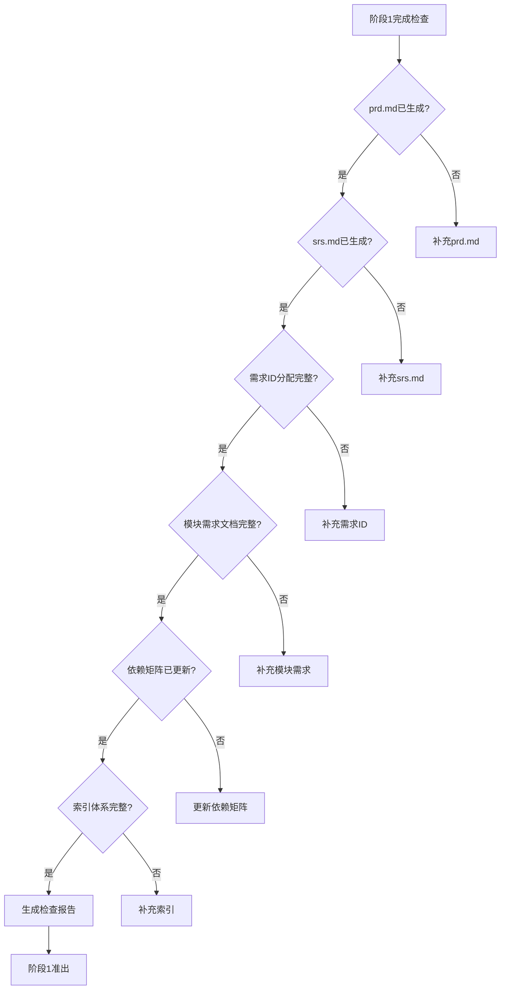
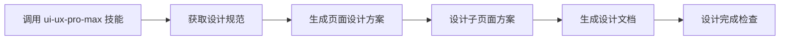
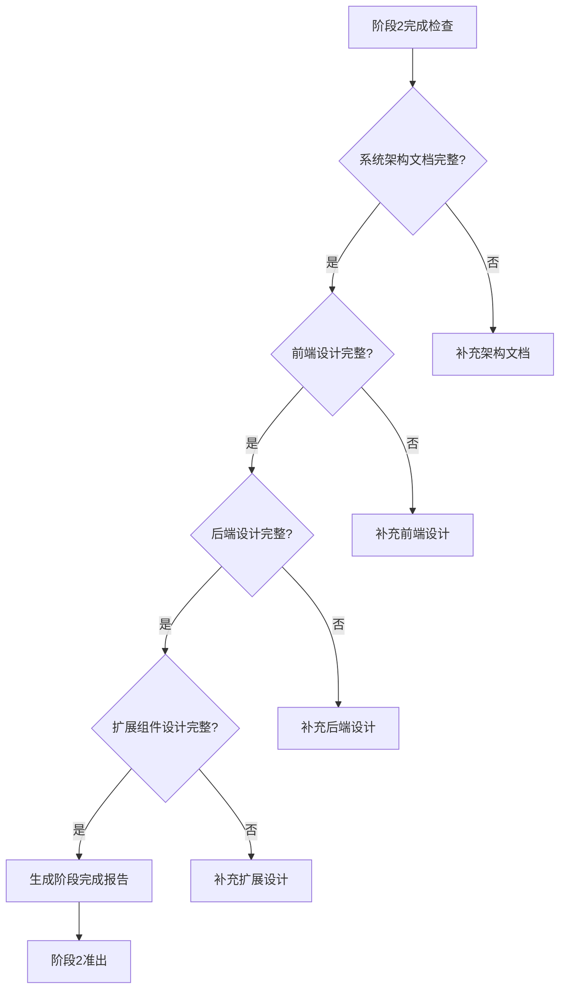
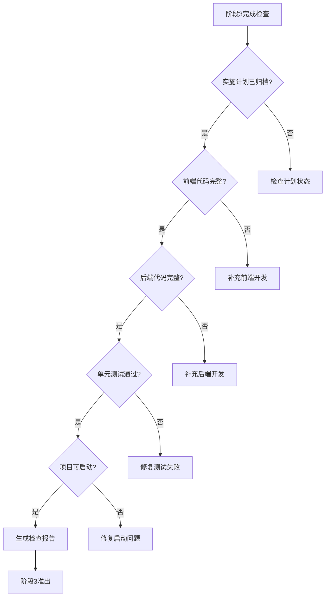
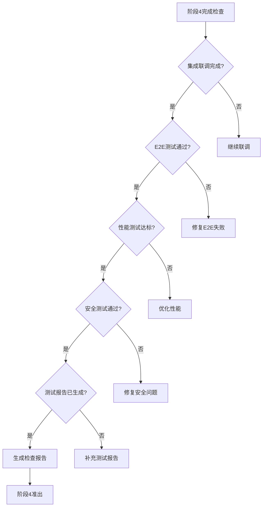
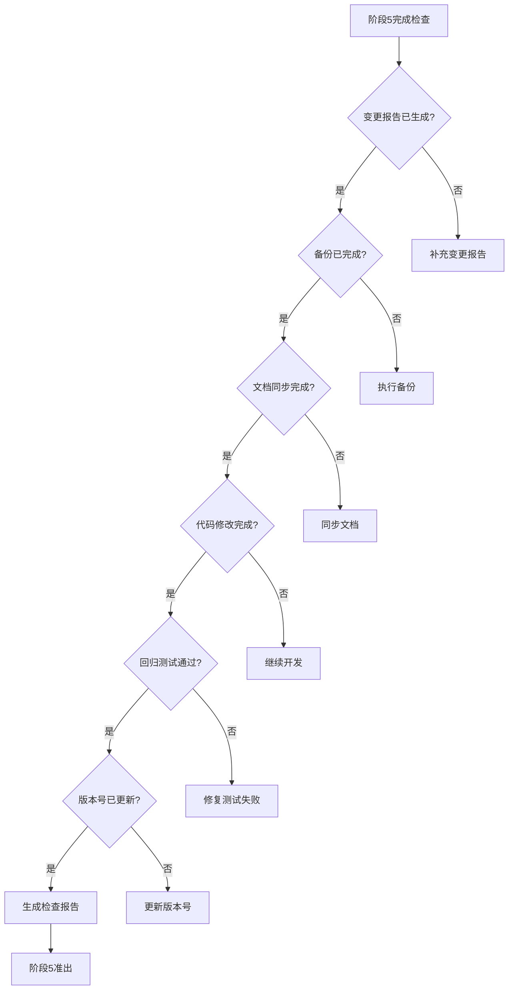

# 全栈开发工作流阶段详细说明

本文档详细描述各阶段的执行目标、步骤和输出物。

---

## 阶段-1：技术栈调研与选型（新项目专属前置阶段）

### 执行目标

根据用户需求智能调研最适合的技术栈、架构模式、设计规范，输出完整的技术选型报告，为后续项目初始化提供锁定依据。

### 前置输入

用户原始需求描述、项目核心目标、预期规模、团队技术背景（可选）

### 标准执行步骤

#### 步骤1：用户需求解析与项目定位

1. 解析用户原始需求，明确项目类型：
   - Web应用（SPA/MPA/PWA）
   - API服务（RESTful/GraphQL/gRPC）
   - AI应用（AI Agent/RAG/LLM应用）
   - 移动应用（原生/混合/小程序）
   - 工具类/CLI工具
   - 行业解决方案

2. 明确项目规模等级：
   - 小型：单功能/工具类，开发周期<2周
   - 中型：多模块/SaaS产品，开发周期2-8周
   - 大型：企业级解决方案，开发周期>8周
   - 超大型：分布式系统，多团队协作

#### 步骤2：主语言选择交互

**必须通过 AskUserQuestion 工具让用户选择主语言方向**

| 选择项 | 子选项 | 适用场景 |
|--------|--------|----------|
| 前端主导 | JavaScript / TypeScript | Web应用、移动应用前端 |
| 后端主导 | Python / Java / JavaScript/TypeScript / Go / Rust / C# | API服务、微服务、AI应用后端 |
| AI工作流 | Python / JavaScript/TypeScript | AI Agent、RAG、LLM应用 |
| 全栈统一 | TypeScript（前后端统一） | 快速迭代、中小型项目 |
| 其他 | 用户自定义 | 特殊需求场景 |

#### 步骤3：技术栈智能调研（基于用户选择）

参见 [tech-stack-matrix.md](tech-stack-matrix.md) 获取完整调研矩阵。

#### 步骤4：技术选型决策（用户确认）

**基于步骤3调研结果，使用 AskUserQuestion 让用户确认最终技术栈**

输出格式示例：
```
## 技术栈选型方案

### 前端技术栈
- 框架：[选定框架] v[版本号]
- 语言：[TypeScript/JavaScript]
- 状态管理：[Redux/Zustand/Pinia/Vuex]
- UI组件库：[Ant Design/Shadcn/Tailwind CSS]
- 构建工具：[Vite/Next.js内置]

### 后端技术栈
- 框架：[选定框架] v[版本号]
- 语言：[Python/Java/TypeScript/Go]
- 数据库：[PostgreSQL/MySQL/MongoDB]
- ORM：[Prisma/TypeORM/Drizzle/ SQLAlchemy]
- API规范：[RESTful/OpenAPI 3.0]

### AI技术栈（如涉及）
- Agent框架：[LangChain/LangGraph/AutoGen]
- 向量数据库：[Pinecone/Milvus]
- LLM接口：[OpenAI/Anthropic/本地模型]

### 基础设施
- 容器化：Docker + Docker Compose
- 版本控制：Git + GitHub/GitLab
- CI/CD：GitHub Actions
```

#### 步骤5：架构模式与设计规范调研

**架构模式调研矩阵**

| 项目类型 | 推荐架构 | 说明 |
|----------|----------|------|
| 小型SPA | 单体分层 | 简单直接，快速交付 |
| 中型Web | 前后端分离 + 模块化 | 清晰边界，易于扩展 |
| 大型企业 | 微服务 + 领域驱动(DDD) | 高扩展，团队协作友好 |
| AI应用 | Agent编排 + RAG管道 | 工作流驱动，知识检索增强 |
| API服务 | RESTful + 版本控制 | 标准化接口，易于集成 |

**设计规范调研**

| 规范类别 | 推荐方案 |
|----------|----------|
| 代码风格 | ESLint + Prettier / Black / gofmt |
| 命名规范 | 文件：kebab-case，变量：camelCase，类：PascalCase |
| 目录规范 | 按功能/领域分层，src/[domain]/[layer] |
| API规范 | OpenAPI 3.0，版本化路由 /api/v1/ |
| 安全规范 | JWT/OAuth2，HTTPS强制，输入校验 |

#### 步骤6：生成技术选型报告文档

生成 `docs/00-requirements/tech-selection-report.md`，参见 [tech-selection-report-template.md](tech-selection-report-template.md)

#### 步骤7：生成 AGENTS.md（AI Agent开发指导文档）

参见 [agents-template.md](agents-template.md) 获取完整模板。

#### 步骤8：自动搜索技术栈 Skills（关键步骤）

**AGENTS.md 生成后，必须自动搜索并引入相关技术栈规范 Skills**

1. **解析 AGENTS.md 中的技术栈清单**

   从 AGENTS.md 中提取所有锁定的技术栈：
   - 前端框架（Next.js/React/Vue/Nuxt 等）
   - 后端框架（FastAPI/NestJS/Spring Boot/Express/Gin 等）
   - ORM（Prisma/TypeORM/SQLAlchemy 等）
   - 数据库（PostgreSQL/MySQL/MongoDB 等）
   - AI框架（LangChain/LangGraph 等）
   - 编程语言（TypeScript/Python/Go 等）

2. **执行 find-skills 搜索**

   对每项技术执行 `/find-skills <技术关键词>` 指令：

   ```
   示例：
   /find-skills nextjs
   /find-skills typescript
   /find-skills prisma
   /find-skills fastapi
   ```

3. **技术栈搜索映射表**

   | 技术栈类型 | 锁定技术 | 自动搜索指令 |
   |------------|----------|--------------|
   | 前端框架 | Next.js | `/find-skills nextjs` |
   | 前端框架 | React | `/find-skills react` |
   | 前端框架 | Vue | `/find-skills vue` |
   | 后端框架 | FastAPI | `/find-skills fastapi` |
   | 后端框架 | NestJS | `/find-skills nestjs` |
   | 后端框架 | Spring Boot | `/find-skills spring-boot` |
   | ORM | Prisma | `/find-skills prisma` |
   | 数据库 | PostgreSQL | `/find-skills postgresql` |
   | AI框架 | LangChain | `/find-skills langchain` |
   | 语言 | TypeScript | `/find-skills typescript` |

4. **用户确认引入 Skills**

   搜索结果汇总后，使用 AskUserQuestion 让用户选择需要引入的 Skills

5. **安装选定的 Skills**

   根据用户选择安装相关 Skills，确保后续开发符合最佳实践

### 强制输出物

1. 技术选型报告文档：`docs/00-requirements/tech-selection-report.md`
2. **AGENTS.md**：项目根目录下的AI Agent开发指导文档
3. 用户确认的技术栈清单（已锁定版本）
4. 架构模式与设计规范文档
5. **已安装的技术栈规范 Skills**（通过 find-skills 引入）

### AI准出校验规则

- 技术栈调研覆盖所有关键组件（前端/后端/数据/AI/基础设施）
- 所有技术选型均有明确的适用场景说明和推荐理由
- 用户已通过 AskUserQuestion 确认最终技术栈方案
- 技术栈版本号已明确锁定，无模糊版本（如"最新版"）
- **AGENTS.md 已生成并包含完整的技术栈锁定信息**
- 架构模式与项目规模匹配
- 设计规范完整可执行
- **已完成技术栈 Skills 搜索，用户已确认是否引入**

---

## 阶段0：项目初始化与自动化底座搭建

### 执行目标

完成标准化骨架搭建、全局规范定义、AI执行边界锁定，同时搭建依赖矩阵和备份体系两大核心自动化底座。

**关键**：无论新项目还是老项目，阶段0完成后都必须生成/更新 `AGENTS.md`

### 前置输入

**新项目**：阶段-1输出的技术选型报告 + AGENTS.md（已生成）
**老项目**：需要先分析现有代码结构，推断技术栈和规范，再生成 AGENTS.md

### 新项目执行流程

1. **定义全局规范**（基于阶段-1技术选型）：
   - 技术栈锁定：明确前后端框架、版本号、核心依赖
   - 编码规范：命名规则、注释规范、代码分层规则、格式化标准
   - 版本规则：语义化版本号规范、分支管理规则
   - 安全基线：鉴权规则、数据加密规则、接口安全规范
   - 文档规范：统一文档模板、命名规则、变更标记规范

2. 按标准目录结构搭建项目骨架（参见 [project-structure.md](project-structure.md)）

3. 生成根索引文档 `docs/index.md`

4. 搭建依赖矩阵 `doc-dependency-matrix.yaml`

5. 搭建自动化版本备份体系

6. 完成首次全量快照备份，生成初始版本v1.0.0

7. **确认 AGENTS.md 已正确生成**（阶段-1已完成）

### 老项目执行流程

1. **分析现有项目结构**：
   - 检查 `package.json` / `requirements.txt` / `go.mod` / `pom.xml` 等依赖文件
   - 分析目录结构，推断分层架构
   - 检查配置文件（ESLint、Prettier、tsconfig、pyproject.toml等）
   - 检查现有代码风格和命名规范

2. **推断技术栈**：

| 分析项 | 检查文件/方式 |
|--------|---------------|
| 前端框架 | package.json 中的 dependencies |
| 后端框架 | requirements.txt / go.mod / pom.xml |
| 数据库 | 配置文件、ORM文件、migration文件 |
| 语言版本 | tsconfig / pyproject.toml / go.mod |
| 构建工具 | package.json scripts / Makefile |
| 测试框架 | 测试文件、配置文件 |

3. **生成/更新 AGENTS.md**：基于分析结果生成完整文件

4. **搭建docs文档体系**：创建标准目录结构和索引文档，包括 `docs/plans/` 目录

5. **搭建依赖矩阵和备份体系**

6. **完成首次全量快照备份**

### 强制输出物

1. 100%符合标准的项目目录结构（新项目）或补充docs体系（老项目）
2. 根索引文档、全局规范文档
3. 依赖矩阵文件
4. 完整的备份体系
5. `version.json`版本管控文件
6. 项目初始化全量快照备份
7. **AGENTS.md**（新项目确认已有，老项目新生成）

---

## 阶段1：需求全链路标准化文档化

### 执行目标

将模糊需求转化为结构化、可量化、可追溯的标准化文档

### 标准执行步骤

1. 需求拆解：业务目标、核心功能、非功能需求、约束条件、异常场景、验收标准
2. 分配唯一需求ID（格式：REQ-模块编码-序号）
3. 生成顶层文档 `prd.md`、`srs.md`
4. 分模块拆解最小单元需求文档
5. 搭建需求域索引体系
6. 同步更新依赖矩阵
7. AI自检

### 阶段完成检查（强制）

**步骤8：生成阶段1完成检查报告**

执行完整检查并生成 `docs/phase-check-reports/phase-1-check.md`：



**检查清单**：

| 检查项 | 检查标准 | 检查方式 |
|--------|----------|----------|
| prd.md | 文件存在，内容完整，含验收标准 | 文件存在性 + 内容检查 |
| srs.md | 文件存在，需求规格完整 | 文件存在性 + 内容检查 |
| 需求ID分配 | 所有需求点有唯一ID，格式正确 | ID格式校验 REQ-XXX-NN |
| 模块需求文档 | 各模块需求文档已生成 | modules/ 目录检查 |
| 依赖矩阵 | 已同步更新需求依赖关系 | doc-dependency-matrix.yaml 检查 |
| 索引体系 | 00-requirements/index.md 已更新 | 索引文件检查 |

**检查报告格式**：

```markdown
# 阶段1完成检查报告

## 检查时间
【YYYY-MM-DD HH:mm:ss】

## 检查结果
【通过/待补充】

## 已完成文档清单
| 文档名称 | 文档路径 | 状态 |
|----------|----------|------|
| prd.md | docs/00-requirements/prd.md | ✅ 完成 |
| ... | ... | ... |

## 未完成项列表
| 检查项 | 问题描述 | 补充建议 |
|--------|----------|----------|
| 【如有未完成项】 | 【问题描述】 | 【补充建议】 |

## 准出判断
【满足所有准出条件，可进入阶段2】/ 【存在未完成项，需补充后准出】
```

### 准出校验

所有需求点有唯一ID、验收标准可量化、无业务矛盾、索引闭环、**检查报告已生成**

---

## 阶段2：系统架构与分端设计

### 子流程2.1 系统架构设计

基于阶段1需求文档和阶段-1技术选型，完成架构设计

### 子流程2.2 前端UI/UX全链路设计（集成 ui-ux-pro-max 技能）

**重要**：前端设计必须使用 `ui-ux-pro-max` 技能进行高质量设计。如果该技能未安装，先使用 `/install-skills ui-ux-pro-max` 安装。

#### 步骤2.2.1 技能检查与安装

```
1. 检查 ui-ux-pro-max 技能是否可用
2. 若不可用，提示用户安装：/install-skills ui-ux-pro-max
3. 技能可用后，调用 Skill 工具激活 ui-ux-pro-max
```

#### 步骤2.2.2 页面地图设计（含子页面）

基于设计系统完成完整页面地图设计，**必须包含所有主页面及其子页面/子路由**：

| 页面层级 | 页面类型 | 设计要求 |
|----------|----------|----------|
| 一级页面 | 主入口页面 | 完整布局、交互、状态设计 |
| 二级页面 | 主页面的子页面/Tab页 | 与父页面的关联、独立状态 |
| 三级页面 | 弹窗/抽屉/详情页 | 触发条件、数据传递、关闭逻辑 |
| 嵌套页面 | 动态路由页面（如 /user/:id） | 参数传递、数据加载逻辑 |

#### 步骤2.2.3 单页面精细化设计（使用 ui-ux-pro-max）

对每个页面（包含子页面）执行精细化设计，参见 [page-design-template.md](page-design-template.md)

**设计执行流程**：



**必须使用 ui-ux-pro-max 技能的设计内容**：
- UI风格选择（50+预设风格）
- 色彩方案（161种配色方案）
- 字体搭配（57种字体组合）
- 响应式布局适配
- UX交互规范（99项UX准则）
- 图表类型选择（如涉及数据可视化）

#### 步骤2.2.4 设计完成检查（强制）

**每个页面设计完成后必须执行检查**：

| 检查项 | 检查标准 | 检查方式 |
|--------|----------|----------|
| 主页面设计文档 | 文档已生成且符合模板规范 | 文件存在性检查 |
| 子页面设计文档 | 所有子页面均有独立设计文档 | 子页面清单核对 |
| 设计一致性 | 主页面与子页面风格统一 | ui-ux-pro-max 设计规范核对 |
| 响应式适配 | 移动端/平板/桌面端布局完整 | 断点规则检查 |
| 交互逻辑闭环 | 所有交互路径可追溯 | 状态流转图验证 |

**检查输出**：生成 `docs/02-frontend-design/design-check-report.md`

### 子流程2.3 后端数据与接口设计

完成领域模型、数据结构、接口规范设计，参见 [api-design-template.md](api-design-template.md)

### 子流程2.4 扩展组件设计（按项目类型）

根据项目类型，完成额外的组件设计文档：

| 项目类型 | 扩展设计内容 | 文档位置 |
|----------|--------------|----------|
| 智能合约项目 | 合约架构、状态变量、方法设计 | `docs/05-smart-contract-design/` |
| AI/LLM应用 | Prompt设计、Agent流程、RAG管道 | `docs/06-ai-design/` |
| E2E测试项目 | 测试场景、数据流、断言规则 | `docs/04-test-acceptance/e2e/` |
| 移动应用 | 平台适配、推送服务、离线策略 | `docs/07-mobile-design/` |
| CLI工具 | 命令设计、参数解析、输出格式 | `docs/08-cli-design/` |

### 子流程2.5 阶段完成总检查（强制）

**阶段2所有子流程完成后执行总检查**：



**检查清单**：

| 检查类别 | 检查项 | 完成标准 |
|----------|--------|----------|
| 架构设计 | system-architecture.md | 文件存在，内容完整 |
| 前端设计 | design-system.md + pages/*.md | 所有页面含子页面已设计 |
| 前端检查 | design-check-report.md | 检查报告已生成 |
| 后端设计 | domain-model.md + api-spec/*.md | 所有接口已设计 |
| 扩展设计 | 按项目类型检查 | 对应目录文档完整 |

---

## 阶段3：分端模块化自动化开发

### 执行目标

基于校验通过的设计文档，按模块完成代码自动化生成。

**关键**：开发代码前必须先生成实施计划（PLAN），无计划不编码！

### 前置输入

阶段2所有子流程校验通过的设计文档、阶段0的全局编码规范、全链路依赖矩阵

### 标准执行步骤

#### 步骤1：生成实施计划（PLAN）- 强制前置步骤

参见 [plan-template.md](plan-template.md) 获取完整计划模板。

**计划文件命名规则**：
- 格式：`PLAN-{类型}-{模块名}-{日期}-{序号}.md`
- 示例：`PLAN-FE-user-module-20260409-001.md`（前端用户模块开发计划）

**计划存档**：
- 新计划存入 `docs/plans/active/`
- 更新 `docs/plans/index.md` 索引
- 计划状态：pending（待执行）、in_progress（执行中）、completed（已完成）、cancelled（已取消）

**用户确认计划**：使用 AskUserQuestion 让用户确认计划是否可行

#### 步骤2：开发前前置校验

AI再次校验对应设计文档的有效性，确认文档已纳入索引、已通过校验、为最新版本

#### 步骤3：标记计划状态为 in_progress

#### 步骤4：模块化拆分开发

严格按照「先底层公共模块、后业务模块；先数据层、后服务层、再接口层；先组件开发、后页面开发」的顺序

#### 步骤5：前端开发执行规范

- 第一步：基于设计系统文档，开发全局样式、基础组件库
- 第二步：基于页面地图文档，搭建路由架构、权限控制框架、全局状态管理
- 第三步：基于单页面设计文档，逐页面开发
- 第四步：页面开发完成后，AI自检

#### 步骤6：后端开发执行规范

- 第一步：基于库表设计文档，生成数据库表结构、初始化SQL
- 第二步：基于领域模型设计文档，开发领域服务、业务规则
- 第三步：基于单接口设计文档，逐接口开发
- 第四步：接口开发完成后，AI自检

#### 步骤7：代码索引体系搭建

完善 `src/frontend/index.md`和 `src/backend/index.md`

#### 步骤8：单元测试自动化生成

核心逻辑覆盖率100%

#### 步骤9：标记计划状态为 completed

#### 步骤10：计划归档与备份

将已完成的计划从 `docs/plans/active/` 移动到 `docs/plans/archived/`

### 强制输出物

1. **实施计划文档**：`docs/plans/active/PLAN-xxx.md` 或 `docs/plans/archived/PLAN-xxx.md`
2. 全量可运行的前端/后端源代码
3. 代码模块两级索引体系
4. 数据库初始化SQL脚本
5. 单元测试代码
6. 更新后的全链路依赖矩阵
7. 开发完成全量快照备份

### AI准出校验规则

- **计划已生成并存档**：无计划不得进入开发阶段
- 计划已通过用户确认
- 代码100%符合对应设计文档的要求
- 所有代码均已纳入索引体系
- 代码符合全局编码规范
- 单元测试覆盖核心业务逻辑，测试通过率100%
- 项目可正常编译、启动
- **计划状态已更新为 completed 并归档**

### 阶段完成检查（强制）

**步骤11：生成阶段3完成检查报告**

执行完整检查并生成 `docs/phase-check-reports/phase-3-check.md`：



**检查清单**：

| 检查项 | 检查标准 | 检查方式 |
|--------|----------|----------|
| 实施计划归档 | PLAN已移至archived/，状态completed | plans/archived/ 检查 |
| 前端代码 | 所有页面已开发，符合设计文档 | src/frontend/ 检查 |
| 后端代码 | 所有接口已开发，符合API规范 | src/backend/ 检查 |
| 单元测试 | 测试通过率100%，覆盖率达标 | 测试执行结果 |
| 项目启动 | 项目可正常编译和启动 | 启动验证 |
| 依赖矩阵 | 已更新代码依赖关系 | doc-dependency-matrix.yaml 检查 |

---

## 阶段4：自动化集成测试与交付

### 执行目标

完成集成联调、全量测试验证、上线交付

### 标准执行步骤

1. **集成联调**：前后端接口对接，验证数据流完整性
2. **E2E测试执行**：基于 `docs/04-test-acceptance/e2e/` 设计执行端到端测试
3. **性能测试**：关键接口性能测试，响应时间达标
4. **安全测试**：安全漏洞扫描，权限校验验证
5. **测试报告生成**：生成完整测试报告
6. **上线交付准备**：部署文档、运维手册

### 阶段完成检查（强制）

**生成阶段4完成检查报告**：`docs/phase-check-reports/phase-4-check.md`



**检查清单**：

| 检查项 | 检查标准 | 检查方式 |
|--------|----------|----------|
| 集成联调 | 前后端接口对接成功，数据流完整 | 联调验证结果 |
| E2E测试 | 所有E2E测试场景通过 | e2e测试执行结果 |
| 性能测试 | 关键接口响应时间达标 | 性能测试报告 |
| 安全测试 | 无高危漏洞，权限校验正确 | 安全扫描报告 |
| 测试报告 | docs/04-test-acceptance/ 报告完整 | 测试报告文件检查 |
| 部署文档 | 上线部署文档已生成 | 部署文档检查 |

---

## 阶段5：需求变更与代码重构全闭环管控

需求变更后自动完成备份→影响分析→关联文档同步更新→校验→代码开发

参见 [change-impact-report-template.md](change-impact-report-template.md) 获取变更影响分析报告模板。

### 标准执行步骤

1. **变更请求接收**：记录变更需求，分配变更ID（格式：CHG-YYYYMMDD-NN）
2. **全量备份**：变更前完成当前状态全量备份
3. **影响分析**：生成变更影响分析报告，识别受影响的文档和代码
4. **文档同步更新**：按照影响分析结果，同步更新所有关联文档
5. **校验文档一致性**：确保文档更新后索引、依赖矩阵同步
6. **代码开发**：基于更新后的文档进行代码修改
7. **回归测试**：执行受影响模块的回归测试
8. **变更完成确认**：验证变更完成，更新版本号

### 阶段完成检查（强制）

**生成阶段5完成检查报告**：`docs/phase-check-reports/phase-5-check.md`



**检查清单**：

| 检查项 | 检查标准 | 检查方式 |
|--------|----------|----------|
| 变更报告 | change-impact-report.md 已生成 | 变更报告文件检查 |
| 备份完成 | 变更前备份已执行 | .version-history/ 检查 |
| 文档同步 | 所有受影响文档已更新 | 文档版本比对 |
| 依赖矩阵 | 已更新文档依赖关系 | doc-dependency-matrix.yaml 检查 |
| 代码修改 | 代码符合变更后的文档要求 | 代码审核 |
| 回归测试 | 受影响模块测试通过 | 测试执行结果 |
| 版本更新 | version.json 已更新版本号 | version.json 检查 |

---