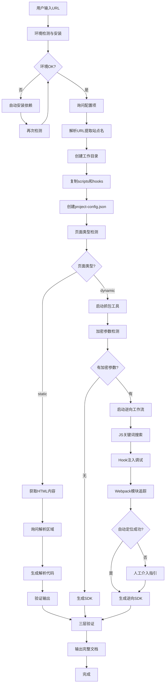
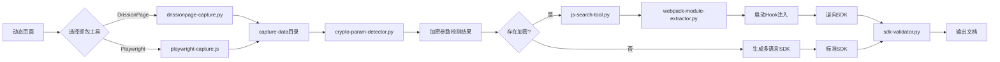

# URL Analyzer & SDK Generator V4.2

## 概述

这个skill实现了一个完整的 URL 逆向分析与 SDK 生成工作流：

1. **输入URL** → 自动判断静态/动态页面
2. **静态页面** → 用户补充解析区域 → 生成请求和数据解析代码
3. **动态页面** → 抓包工具捕获请求 → 分析加密参数
   - 无加密 → 生成多语言SDK
   - 有加密 → 进入 JS 搜索 + Hook 调试 + Webpack 依赖追踪
4. **完整输出** → 分析报告 + SDK文档 + README + 三层验证结果

## 流程图

### 整体工作流程



### 动态页面分支详情



### Hook注入调试流程

```mermaid
flowchart TB
    A[存在加密参数] --> B{选择注入方式}
    B -->|DrissionPage| C[hook-inject-drissionpage.py]
    B -->|Playwright| D[hook-inject-playwright.py]

    C --> E[选择Hook脚本]
    D --> E

    E --> F{Hook类型}
    F -->|综合| G[all-in-one-hook.js]
    F -->|加密| H[crypto-hook.js]
    F -->|XHR| I[xhr-hook.js]
    F -->|调试| J[debug-hook.js]

    G --> K[注入并等待]
    H --> K
    I --> K
    J --> K

    K --> L[获取拦截数据]
    L --> M[分析加密入口]
    M --> N[定位加密函数]
    N --> O[追踪 n("moduleId") 依赖]
    O --> P[提取 key/iv/salt 模块]
```

## 触发条件

- 用户输入 `/analyze-url` 命令
- 用户输入包含 URL 且上下文暗示需要分析、抓包、逆向或生成 SDK
- 用户要求定位签名算法、提取前端密钥、验证真实 API 请求

## 参考文档索引

按需引入以下参考文档：

| 文档 | 用途 | 引入时机 |
| --- | --- | --- |
| [workspace-structure.md](references/workspace-structure.md) | 工作目录结构和配置文件 | Phase 0 初始化时 |
| [capture-tools.md](references/capture-tools.md) | DrissionPage/Playwright抓包使用 | Phase 2B抓包时 |
| [hook-injection.md](references/hook-injection.md) | Hook注入调试指南 | Phase 3逆向时 |
| [js-search-tool.md](references/js-search-tool.md) | JS关键词搜索与Webpack分析 | Phase 2B/3分析时 |
| [crypto-reverse-guide.md](references/crypto-reverse-guide.md) | 加密逆向分析方法 | Phase 3逆向时 |
| [sdk-best-practices.md](references/sdk-best-practices.md) | SDK生成最佳实践 | Phase 4生成SDK时 |
| [output-specification.md](references/output-specification.md) | 输出物规范 | Phase 4输出时 |
| [validation-flow.md](references/validation-flow.md) | SDK验证流程 | Phase 4验证时 |
| [tech-dependencies.md](references/tech-dependencies.md) | Python/Node.js依赖列表 | 环境准备时 |
| [quick-start.md](references/quick-start.md) | 快速开始指南 | 首次使用时 |

## 前置配置询问

**必须首先询问用户以下配置项**（使用 `AskUserQuestion` 工具，一次最多问四个，分批次询问）：

### 第一批询问

1. **抓包工具**: DrissionPage(推荐) / Playwright
2. **浏览器数据目录**: 项目目录下(推荐) / 自定义目录
3. **浏览器选择**: Chrome(推荐) / Edge / Chromium(仅Playwright) / Firefox(仅Playwright)
4. **执行模式**: 无头模式(推荐) / 有头模式

### 第二批询问

5. **登录需求**: 需要登录 / 不需要登录
6. **SDK语言**: Python / JavaScript/Node.js / Java / Go（多选）

## 工作流程

### Phase -1: 环境检测与安装（前置操作）

**必须在所有 Phase 之前执行**，确保环境依赖已就绪：

```bash
python scripts/check-environment.py
python scripts/check-environment.py --auto-install
python scripts/check-environment.py --quiet
python scripts/check-environment.py --json
```

**检测内容**：
- Python 版本 (需要 >= 3.8)
- Node.js 版本 (需要 >= 16.0，Playwright抓包需要)
- Python 必需包: DrissionPage, lxml, beautifulsoup4, pycryptodome, pyexecjs2, loguru
- Python 可选包: curl_cffi, playwright, ddddocr, selenium, scrapy
- Node.js 可选包: playwright, crypto-js, jsdom, axios
- 浏览器环境: Chrome, Edge, Chromium, Firefox

**输出**：
- 控制台彩色输出检测结果
- `environment-report.json` - 详细检测报告 JSON 文件

### Phase 0: 前置配置与工作目录初始化

**参考**: [workspace-structure.md](references/workspace-structure.md)

1. 询问用户配置（分两批询问）
2. 解析 URL 提取站点名称
3. 在当前项目路径下创建 `reverse-projects/{site_name}/` 目录
4. 初始化完整的子目录结构，并自动复制脚本和 Hook 文件
5. 创建配置文件 `project-config.json`
6. 确认项目目录中已有：
   - `check-environment.py`
   - `js-search-tool.py`
   - `webpack-module-extractor.py`
   - `sdk-validator.py`

### Phase 1: URL接收与初步分析

```bash
cd reverse-projects/{site_name}
python scripts/page-type-detector.py "{url}"
```

输出：页面类型判定结果（static/dynamic/ajax-api）+ 初步分析报告

### Phase 2A: 静态页面处理流程

当判定为静态页面时执行：

1. 获取页面内容
2. 询问用户解析区域
3. 生成解析代码
4. 验证与输出

### Phase 2B: 动态页面处理流程

**参考**: [capture-tools.md](references/capture-tools.md) | [js-search-tool.md](references/js-search-tool.md)

当判定为动态页面时执行：

1. **启动抓包工具**
   - DrissionPage: `python scripts/drissionpage-capture.py --url "{url}" --output "./capture-data"`
   - Playwright: `node scripts/playwright-capture.js "{url}" "./capture-data"`
2. **加密参数检测**
   ```bash
   python scripts/crypto-param-detector.py capture-data/xhr/api-requests.json
   ```
3. **JS代码搜索分析**
   ```bash
   python scripts/js-search-tool.py --js-dir capture-data/js/ --keywords "encrypt,sign,md5,sha,portal-sign"
   ```
4. **Webpack模块依赖追踪**
   ```bash
   python scripts/webpack-module-extractor.py capture-data/js/app.js --find-sign-func
   # 根据输出定位签名函数所在模块，再继续提取具体模块
   python scripts/webpack-module-extractor.py capture-data/js/app.js --extract-module b775
   python scripts/webpack-module-extractor.py capture-data/js/app.js --extract-module a078
   ```
5. **分支处理**
   - 无加密参数 → 生成 SDK
   - 存在加密参数 → 启动逆向工作流（Phase 3）

### Phase 3: 逆向工作流（Hook注入调试）

**参考**: [hook-injection.md](references/hook-injection.md) | [crypto-reverse-guide.md](references/crypto-reverse-guide.md)

当存在加密参数时执行：

1. 选择 Hook 注入方式
2. 列出可用 Hook 脚本
3. 执行 Hook 注入调试（推荐 `all-in-one-hook.js`）
4. 分析 Hook 输出结果
5. 结合 `js-search-tool.py` 与 `webpack-module-extractor.py` 定位加密代码
6. 追踪 `var r = n("a078")` 这类依赖链，定位真实 key/iv/salt 模块
7. 自动定位失败时，提供人工介入指引
8. 生成逆向 SDK

### Phase 4: 验证与输出

**参考**: [validation-flow.md](references/validation-flow.md) | [output-specification.md](references/output-specification.md) | [sdk-best-practices.md](references/sdk-best-practices.md)

逆向完成后**必须执行**：

1. **L1 签名算法验证**
   - 使用抓包参数生成签名
   - 与抓包中的签名对比
   - **必须 100% 匹配**

2. **L2 真实接口请求验证**
   ```bash
   python scripts/sdk-validator.py --sdk-path "./output/sdk/python/" --test-url "{原始URL}"
   ```
   - 必须验证真实请求能通过
   - 默认优先使用 `curl_cffi` 发起请求，必要时设置 `impersonate="chrome"`

3. **L3 响应数据解密验证**
   - 验证解密后的结构正确
   - 关键字段完整

4. **输出完整文档**
   - `output/analysis-report.md`
   - `output/sdk-document.md`
   - `output/README.md`
   - `output/sdk/{language}/`
   - `validation/test-results.json`
   - `validation/verify-log.md`

## Hook脚本列表

| Hook脚本 | 功能描述 |
| --- | --- |
| `all-in-one-hook.js` | 综合Hook（推荐） |
| `xhr-hook.js` | XHR请求拦截 |
| `fetch-hook.js` | Fetch请求拦截 |
| `crypto-hook.js` | 加密函数拦截 |
| `debug-hook.js` | 调试断点工具 |

## 使用示例

```text
用户: /analyze-url https://api.example.com/v2/data?id=123&sign=abc123

Skill执行:
[Phase 0] 初始化工作目录 → reverse-projects/example-api/
[Phase 0] 创建项目配置 → project-config.json
[Phase 1] 页面类型 → dynamic (置信度: 85%)
[Phase 2B] DrissionPage抓包 → 30个XHR请求
[Phase 2B] JS搜索 → 发现3个包含sign关键词的文件
[Phase 2B] Webpack模块提取 → 找到签名模块依赖 a078
[Phase 3] Hook注入分析 → 定位加密函数与密钥模块
[Phase 3] 逆向成功 → 生成带签名和解密逻辑的SDK
[Phase 4] 三层验证通过
[Phase 4] 输出完成 → analysis-report.md, sdk-document.md, README.md, sdk/python/
```

## 经验教训与最佳实践

### 1. 原始 skill/流程的典型漏洞

- `init-workspace.py` 只复制基础脚本时，后续项目会缺少关键逆向工具。
- 只做 JS 关键词搜索，不做依赖链追踪，容易误判“签名函数模块 = 密钥模块”。
- 只生成 SDK 不做真实接口验证，得到的代码往往只是“看起来正确”。

**现在必须保证**：
- 初始化后项目目录里有 `check-environment.py`
- 初始化后项目目录里有 `webpack-module-extractor.py`
- 初始化后项目目录里有 `sdk-validator.py`
- 初始化后的 README 明确要求三层验证

### 2. 签名算法逆向的常见坑

**错误假设**：标准 URL 参数拼接 `key=value&key2=value2`

**正确做法**：从 JS 中提取真实拼接逻辑，再用抓包数据逐组校验。

重点检查：
- 是否按 key 排序
- 是否没有 `=` / `&` 分隔符
- 空值是否被删除
- 对象/数组是否 `JSON.stringify`
- 编码是否一致

### 3. Webpack 模块追踪经验

定位签名函数后，继续追踪：

```javascript
var r = n("a078")
```

这类依赖往往才是真正的配置/密钥模块。提取重点：
- 导出的常量名
- `n.d(e, "e" ...)` 一类导出声明
- 16/32/64 长度的候选 key/iv/salt 值

### 4. 默认 HTTP 客户端策略

真实接口验证优先使用：

```python
from curl_cffi import requests
session = requests.Session(impersonate="chrome")
```

原因：
- 标准 `requests` 的 TLS 指纹容易被 WAF 拦截
- `curl_cffi` 更接近真实浏览器网络栈

### 5. SDK 可用性的黄金标准

| 层级 | 验证内容 | 通过标准 |
| --- | --- | --- |
| L1 | 签名匹配 | 与抓包签名 100% 相同 |
| L2 | 接口请求 | 真实 API 返回成功状态 |
| L3 | 数据解密 | 解密后结构和字段正确 |

没有完成这三层验证的 SDK，不算完成。

## 快速开始

```bash
python .claude/skills/url-analyzer-sdk-gen/scripts/init-workspace.py --url "https://api.example.com"
cd reverse-projects/example-api
python scripts/check-environment.py --json
python scripts/page-type-detector.py "https://api.example.com"
python scripts/drissionpage-capture.py --url "https://api.example.com" --output "./capture-data"
```

## 相关资源

### Skill源目录
- **初始化脚本**: `scripts/init-workspace.py`
- **脚本模板**: `scripts/`
- **Hook模板**: `hooks/`
- **输出模板**: `assets/`

### 项目工作目录
初始化后复制到 `reverse-projects/{site_name}/`：
- **scripts/** - 所有分析脚本
- **hooks/** - Hook脚本
- **hook-output/** - Hook调试输出
- **validation/** - 验证结果
- **browser-data/** - 浏览器数据目录
