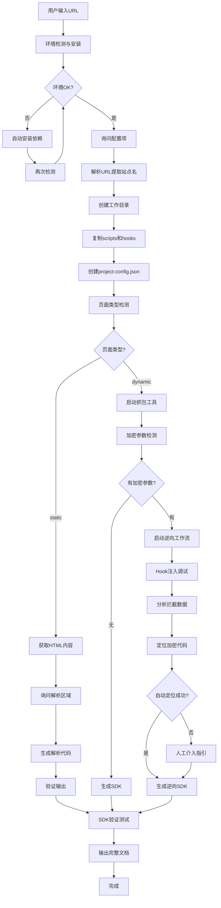
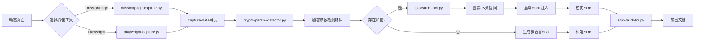
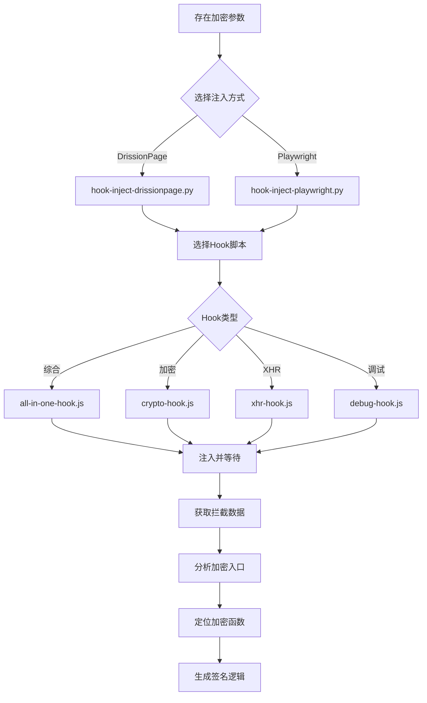

# URL Analyzer & SDK Generator V4.1

## 概述

这个skill实现了一个完整的URL逆向分析与SDK生成工作流：

1. **输入URL** → 自动判断静态/动态页面
2. **静态页面** → 用户补充解析区域 → 生成请求和数据解析代码
3. **动态页面** → 抓包工具捕获请求 → 分析加密参数
   - 有加密 → 启动逆向工作流分析加密参数（**Hook注入调试**）
   - 无加密 → 生成多语言SDK（Python/JS/Java等）
4. **完整输出** → 分析报告 + SDK文档 + README + 验证结果

## 流程图

### 整体工作流程



### 动态页面分支详情



### Hook注入调试流程



## 触发条件

- 用户输入 `/analyze-url` 命令
- 用户输入包含URL格式（如 `https://example.com/...`）且上下文暗示需要分析

## 参考文档索引

按需引入以下参考文档：

| 文档                                          | 用途                               | 引入时机                         |
| --------------------------------------------- | ---------------------------------- | -------------------------------- |
| [workspace-structure.md](references/workspace-structure.md)   | 工作目录结构和配置文件     | Phase 0 初始化时        |
| [capture-tools.md](references/capture-tools.md)               | DrissionPage/Playwright抓包使用 | Phase 2B抓包时         |
| [hook-injection.md](references/hook-injection.md)             | Hook注入调试指南           | Phase 3逆向时          |
| [js-search-tool.md](references/js-search-tool.md)             | JS关键词搜索工具使用   | Phase 2B/3分析时       |
| [crypto-reverse-guide.md](references/crypto-reverse-guide.md) | 加密逆向分析方法           | Phase 3逆向时          |
| [sdk-best-practices.md](references/sdk-best-practices.md)     | SDK生成最佳实践             | Phase 4生成SDK时       |
| [output-specification.md](references/output-specification.md)  | 输出物规范                   | Phase 4输出时          |
| [validation-flow.md](references/validation-flow.md)           | SDK验证流程               | Phase 4验证时          |
| [tech-dependencies.md](references/tech-dependencies.md)       | Python/Node.js依赖列表 | 环境准备时              |
| [quick-start.md](references/quick-start.md)                   | 快速开始指南               | 首次使用时              |

## 前置配置询问

**必须首先询问用户以下配置项**（使用 `AskUserQuestion` 工具，一次最多问四个，分批次询问）：

### 第一批询问

1. **抓包工具**: DrissionPage(推荐) / Playwright
2. **浏览器数据目录**: 项目目录下(推荐) / 自定义目录
3. **浏览器选择**: Chrome(推荐) / Edge / Chromium(仅Playwright) / Firefox(仅Playwright)
4. **执行模式**: 无头模式(推荐) / 有头模式

### 第二批询问

5. **登录需求**: 需要登录 / 不需要登录
6. **SDK语言**: Python / JavaScript/Node.js / Java / Go（多选）

## 工作流程

### Phase -1: 环境检测与安装（前置操作）

**必须在所有Phase之前执行**，确保环境依赖已就绪：

```bash
# 基础检测（仅检查，不安装）
python scripts/check-environment.py

# 自动检测并安装缺失依赖
python scripts/check-environment.py --auto-install

# 静默模式（适合脚本调用）
python scripts/check-environment.py --quiet

# 仅输出JSON报告
python scripts/check-environment.py --json
```

**检测内容**：
- Python 版本 (需要 >= 3.8)
- Node.js 版本 (需要 >= 16.0，Playwright抓包需要)
- Python 必需包: requests, DrissionPage, playwright, lxml, beautifulsoup4, pycryptodome, pyexecjs2, loguru
- Python 可选包: curl_cffi, ddddocr, selenium, scrapy
- Node.js 必需包: playwright
- Node.js 可选包: crypto-js, jsdom, axios
- 浏览器环境: Chrome, Edge, Chromium, Firefox

**输出**：
- 控制台彩色输出检测结果
- `environment-report.json` - 详细检测报告JSON文件

**如果检测失败**：
1. 使用 `--auto-install` 自动安装缺失依赖
2. 或手动执行：
   ```bash
   pip install -r requirements.txt
   npm install
   playwright install
   ```

### Phase 0: 前置配置与工作目录初始化

**参考**: [workspace-structure.md](references/workspace-structure.md)

1. **询问用户配置**（分两批询问）
2. **解析URL提取站点名称**（如 `api.example.com` → `example-api`）
3. **在当前项目路径下创建** `reverse-projects/{site_name}/` 目录
4. **初始化完整的子目录结构，并自动复制脚本和Hook文件**
5. **创建配置文件** `project-config.json`

### Phase 1: URL接收与初步分析

**必须执行**（在项目工作目录内）：

```bash
cd reverse-projects/{site_name}
python scripts/page-type-detector.py "{url}"
```

**输出**: 页面类型判定结果（static/dynamic/ajax-api）+ 初步分析报告

### Phase 2A: 静态页面处理流程

**当判定为静态页面时执行**：

1. **获取页面内容** → 使用requests获取HTML，保存快照
2. **询问用户解析区域** → CSS选择器 / XPath / 数据描述
3. **生成解析代码** → 使用 `assets/static-parser-template.py` 模板
4. **验证与输出** → 输出到 `output/sdk/python/`

### Phase 2B: 动态页面处理流程

**参考**: [capture-tools.md](references/capture-tools.md) | [js-search-tool.md](references/js-search-tool.md)

**当判定为动态页面时执行**（在项目工作目录内）：

1. **启动抓包工具**
   - DrissionPage: `python scripts/drissionpage-capture.py --url "{url}" --output "./capture-data"`
   - Playwright: `node scripts/playwright-capture.js "{url}" "./capture-data"`
2. **加密参数检测**
   ```bash
   python scripts/crypto-param-detector.py capture-data/xhr/api-requests.json
   ```
3. **JS代码搜索分析**
   ```bash
   python scripts/js-search-tool.py --js-dir capture-data/js/ --keywords "encrypt,sign,md5"
   ```
4. **分支处理**
   - 无加密参数 → 生成SDK
   - 存在加密参数 → 启动逆向工作流（Phase 3）

### Phase 3: 逆向工作流（Hook注入调试）

**参考**: [hook-injection.md](references/hook-injection.md) | [crypto-reverse-guide.md](references/crypto-reverse-guide.md)

**当存在加密参数时执行**：

1. **选择Hook注入方式**（根据Phase 0选择的抓包工具）
   - DrissionPage: `scripts/hook-inject-drissionpage.py`
   - Playwright: `scripts/hook-inject-playwright.py`

2. **列出可用Hook脚本**
   ```bash
   python scripts/hook-inject-drissionpage.py --list-hooks
   ```

3. **执行Hook注入调试**（推荐使用 `all-in-one-hook.js`）
   ```bash
   python scripts/hook-inject-drissionpage.py \
       --url "{url}" \
       --hook "all-in-one-hook.js" \
       --output "./hook-output" \
       --wait 30
   ```

4. **分析Hook输出结果** → 查看 `hook-output/intercept/analysis.json`

5. **定位加密代码** → 结合JS搜索工具和Console调用栈

6. **人工介入指引** → 当自动分析无法定位时，提供详细指引

7. **生成逆向SDK** → 使用 `assets/reverse-sdk-template.py` 模板

### Phase 4: 验证与输出

**参考**: [validation-flow.md](references/validation-flow.md) | [output-specification.md](references/output-specification.md) | [sdk-best-practices.md](references/sdk-best-practices.md)

**逆向完成后必须执行**：

1. **SDK验证测试**
   ```bash
   python scripts/sdk-validator.py --sdk-path "./output/sdk/python/" --test-url "{原始URL}"
   ```

2. **输出完整文档**
   - `output/analysis-report.md` - 逆向分析报告
   - `output/sdk-document.md` - SDK接口说明文档
   - `output/README.md` - 使用说明
   - `output/sdk/{language}/` - SDK代码

## Hook脚本列表

**详细使用**: [hook-injection.md](references/hook-injection.md)

| Hook脚本            | 功能描述           |
| ------------------- | ------------------ |
| `all-in-one-hook.js`| 综合Hook（推荐）   |
| `xhr-hook.js`       | XHR请求拦截        |
| `fetch-hook.js`     | Fetch请求拦截      |
| `crypto-hook.js`    | 加密函数拦截       |
| `debug-hook.js`     | 调试断点工具       |

## 使用示例

```
用户: /analyze-url https://api.example.com/v2/data?id=123&sign=abc123

Skill执行:
[Phase 0] 初始化工作目录 → reverse-projects/example-api/
[Phase 0] 创建项目配置 → project-config.json
[Phase 1] 页面类型 → dynamic (置信度: 85%)
[Phase 2B] DrissionPage抓包 → 30个XHR请求
[Phase 2B] JS搜索 → 发现3个包含sign关键词的文件
[Phase 3] 加密参数检测 → sign (MD5特征)
[Phase 3] Hook注入分析 → 定位加密函数在 chunk_456.js
[Phase 3] 逆向成功 → sign = MD5(id + timestamp + secret_key)
[Phase 4] SDK验证通过
[Phase 4] 输出完成 → analysis-report.md, sdk-document.md, README.md, sdk/python/
```

## 环境准备

**详细依赖**: [tech-dependencies.md](references/tech-dependencies.md)

```bash
# Python依赖
pip install -r requirements.txt

# Node.js依赖（可选，仅Playwright）
npm install
npx playwright install chromium
```

## 快速开始

**详细指南**: [quick-start.md](references/quick-start.md)

```bash
# 1. 初始化项目
python .claude/skills/url-analyzer-sdk-gen/scripts/init-workspace.py --url "https://api.example.com"

# 2. 进入项目目录
cd reverse-projects/example-api

# 3. 执行分析
python scripts/page-type-detector.py "https://api.example.com"
python scripts/drissionpage-capture.py --url "https://api.example.com" --output "./capture-data"
```

## 相关资源

### Skill源目录

- **初始化脚本**: `scripts/init-workspace.py`
- **脚本模板**: `scripts/`
- **Hook模板**: `hooks/`
- **输出模板**: `assets/`

### 项目工作目录

初始化后复制到 `reverse-projects/{site_name}/`：

- **scripts/** - 所有分析脚本
- **hooks/** - Hook脚本